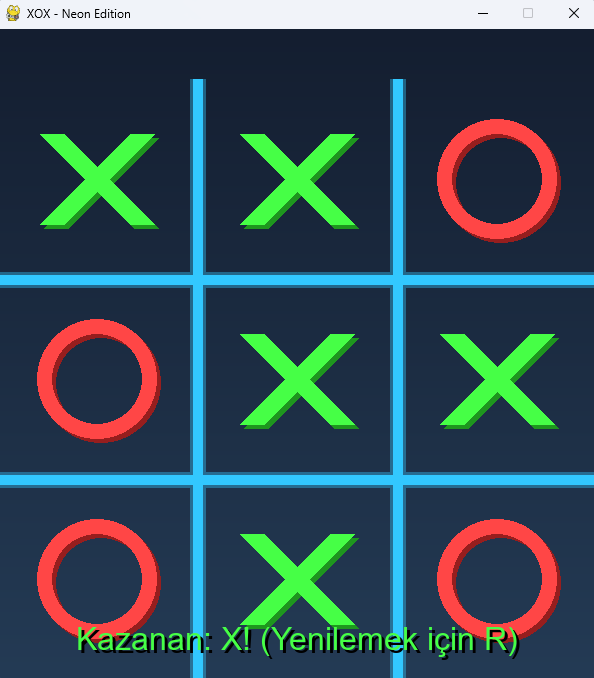

# Neon XOX: Modern Ağ Tabanlı Tic-Tac-Toe 🎮


**Neon XOX**, klasik Tic-Tac-Toe (XOX) oyununu modern neon grafikler, gölge efektleri ve gelişmiş ağ altyapısı ile yeniden yorumlayan bir Python projesidir. Pygame kütüphanesi kullanılarak geliştirilmiştir.


*(Oyun içi ekran görüntüsünü buraya ekleyebilirsiniz)*

## ✨ Temel Özellikler

* **3 Farklı Oyun Modu:**
    1.  🧠 **Bilgisayara Karşı (AI):** Yapay zekaya karşı oynayarak strateji geliştirin.
    2.  👥 **Yerel (2 Kişi):** Aynı bilgisayarda arkadaşınızla karşılıklı oynayın.
    
    3.  🌐 **Ağ Oyunu (LAN):** Yerel ağ üzerindeki iki farklı bilgisayarda gerçek zamanlı kapışın.
    
* **Modern Görsel Tasarım:**
    * Gradyan (renk geçişli) arka planlar.
    * Neon efektli ızgara ve semboller.
    * Gölgelendirilmiş butonlar ve metinler.
* **⏳ Rekabetçi Süre Sınırı:** Her hamle için 10 saniye süreniz var! Süre dolarsa oyunu kaybedersiniz.
* **Bekleme Odası:** LAN modunda rakip bağlanana kadar sunucu bekleme ekranında kalır.

## 🛠️ Kurulum

Projeyi bilgisayarınızda çalıştırmak için Python 3 ve Pygame gereklidir.

1.  **Repoyu Klonlayın:**
    ```bash
    git clone [https://github.com/kullaniciadi/neon-xox.git](https://github.com/kullaniciadi/neon-xox.git)
    cd neon-xox
    ```

2.  **Sanal Ortamı Oluşturun (Önerilen):**
    * *Windows:*
        ```bash
        python -m venv venv
        .\venv\Scripts\Activate.ps1
        ```
    * *macOS / Linux:*
        ```bash
        python3 -m venv venv
        source venv/bin/activate
        ```

3.  **Gereksinimleri Yükleyin:**
    ```bash
    pip install -r requirements.txt
    ```

4.  **Oyunu Başlatın:**
    ```bash
    python main.py
    ```

## 🎮 Nasıl Oynanır?

### Kontroller
* **Fare:** Menü seçimi ve hamle yapmak için sol tık.
* **ESC:** Oyunu sıfırlayıp ana menüye dönmek için.
* **R:** Oyun bittiğinde hızlıca yeniden başlatmak için.

### 🌐 LAN (Ağ) Modu Nasıl Kullanılır?

İki farklı bilgisayarın aynı Wi-Fi veya kablolu ağa bağlı olduğundan emin olun.

1.  **Sunucu (Host) Bilgisayar:**
    * Oyunu açın -> **Ağ Oyunu (LAN)** seçeneğine tıklayın.
    * Konsol penceresine geçin ve **`1`** (Oyunu Kur) seçeneğini seçin.
    * Ekranda *"Rakip Bağlanması Bekleniyor..."* yazısı çıkacaktır.

2.  **İstemci (Client) Bilgisayar:**
    * Oyunu açın -> **Ağ Oyunu (LAN)** seçeneğine tıklayın.
    * Konsol penceresine geçin ve **`2`** (Oyuna Katıl) seçeneğini seçin.
    * Sunucunun yerel IP adresini girin (Varsayılan `127.0.0.1` ise boş geçin, farklıysa `192.168.1.X` formatında girin).

3.  Bağlantı sağlandığında oyun her iki ekranda da otomatik başlar!

## 📂 Dosya Yapısı

Proje modüler bir mimari kullanır:

* `main.py`: Oyunun giriş noktası, çizim döngüsü ve durum yönetimi.
* `game_engine.py`: Oyun kuralları, hamle kontrolü ve kazanma mantığı.
* `network_manager.py`: Socket programlama, veri transferi ve bağlantı yönetimi.
* `ai_bot.py`: Bilgisayar rakibinin mantığı.
* `constants.py`: Renkler, boyutlar, ayarlar ve sabitler.

## 🤝 Katkıda Bulunma

Projeye katkıda bulunmak isterseniz:
1.  Fork yapın.
2.  Yeni bir özellik dalı (feature branch) oluşturun.
3.  Değişikliklerinizi commit edin.
4.  Pull Request gönderin.

---
*İyi Eğlenceler!* 🚀